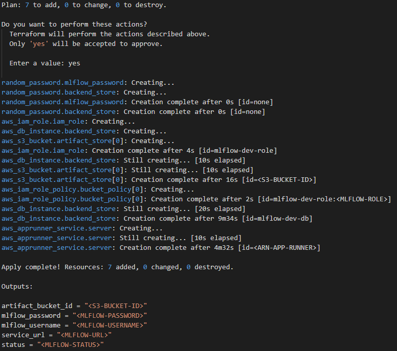

# [MLflow](https://www.mlflow.org/) using AWS App Runner

This project deploys an MLflow instance with basic auth (username/password) in AWS App Runner.

## Architecture


<details><summary>Amazon ECR</summary>
<p>

[Amazon Elastic Container Registry (ECR)](https://aws.amazon.com/ecr/) is a fully managed container registry that makes it easy to store, manage, share, and deploy your container images and artifacts anywhere.

</p>
</details>

<details><summary>App Runner</summary>
<p>

[AWS App Runner](https://aws.amazon.com/apprunner/) is a fully managed service that makes it easy for developers to quickly deploy containerized web applications and APIs, at scale and with no prior infrastructure experience required. Start with your source code or a container image.

</p>
</details>

<details><summary>Amazon S3</summary>
<p>

[Amazon Simple Storage Service (Amazon S3)](https://aws.amazon.com/s3/) is an object storage service that offers industry-leading scalability, data availability, security, and performance.

</p>
</details>

<details><summary>Amazon RDS</summary>
<p>

[Amazon Relational Database Service (Amazon RDS)](https://aws.amazon.com/rds/) makes it easy to set up, operate, and scale a relational database in the cloud. Amazon RDS provides six familiar database engines to choose from, including Amazon Aurora, PostgreSQL, MySQL, MariaDB, Oracle Database, and SQL Server. 

</p>
</details>

## Environment Variables

The environment variables below are required to deploy this project.

| Variable | Description | Default |
| - | - | - |
| PORT | Port for the MLflow server | `80` |
| MLFLOW_ARTIFACT_URI | S3 Bucket URI for MLflow's artifact store | `"./mlruns"`
| MLFLOW_BACKEND_URI | [SQLAlchemy database uri](https://docs.sqlalchemy.org/en/latest/core/engines.html#database-urls) (if provided, the other variables `MLFLOW_DB_*` are ignored) | |
| MLFLOW_DB_DIALECT | Database dialect (e.g. postgresql, mysql+pymysql, sqlite) | `"mysql+pymysql"` |
| MLFLOW_DB_USERNAME | Backend store username | `"mlflow"` |
| MLFLOW_DB_PASSWORD | Backend store password | `"mlflow"` |
| MLFLOW_DB_HOST | Backend store host | |
| MLFLOW_DB_PORT | Backend store port | `3306` |
| MLFLOW_DB_DATABASE | Backend store database | `"mlflow"` |
| MLFLOW_TRACKING_USERNAME | Username for MLflow UI and API | `"mlflow"` |
| MLFLOW_TRACKING_PASSWORD | Password for MLflow UI and API | `"mlflow"` |

## Using your deployed MLflow

You can access the MLflow UI in your App Runner URL: https://XXXXXXXXX.aws-region.awsapprunner.com/


Also, you can track your experiments using MLflow API.

```python
import os
import mlflow

os.environ["MLFLOW_TRACKING_URI"] = "https://XXXXXXXXX.aws-region.awsapprunner.com/"
os.environ["MLFLOW_EXPERIMENT_NAME"] = "amazing-experiment"
os.environ["MLFLOW_TRACKING_USERNAME"] = "user"
os.environ["MLFLOW_TRACKING_PASSWORD"] = "pass"

# AWS AK/SK are required to upload artifacts to S3 Bucket
os.environ["AWS_ACCESS_KEY_ID"] = "AWS_ACCESS_KEY"
os.environ["AWS_SECRET_ACCESS_KEY"] = "AWS_SECRET_KEY"

SEED = 1993

mlflow.start_run()
mlflow.log_param("seed", SEED)
mlflow.end_run()
```

## How to deploy MLflow with auth

In this section, we'll walk through deploying this MLflow docker image with basic authentication.

This project provides a terraform stack that can be easily used to deploy the MLflow server with basic authentication.

> **NOTE**: This project is not intended to be used for production deployments. It is intended to be used for testing and development.

### Prerequisites

You'll need to have the following installed:

- [AWS CLI](https://aws.amazon.com/cli/)
- [Terraform CLI](https://www.terraform.io/downloads.html)

### Deploying MLflow

To deploy MLflow, you'll need to:

1. [Create an AWS account](https://aws.amazon.com/free/) if you don't already have one.

2. Configure AWS CLI to use your AWS account.

3. Clone the repository: [github.com/DougTrajano/mlflow-server](https://github.com/DougTrajano/mlflow-server/)

4. Open `mlflow-server/terraform` folder.

```bash
cd mlflow-server/terraform
```

5. Run the following command to create all the required resources:

```bash
terraform init
terraform apply -var mlflow_username="USERNAME-HERE" -var mlflow_password="PASSWORD-HERE"
```

6. Type "yes" when prompted to continue.

This will create the following resources:

- An [S3 bucket](https://aws.amazon.com/s3/) for storing MLflow artifacts.
- An [IAM role and policy](https://aws.amazon.com/iam/) for the MLflow server connect to the S3 bucket.
- An [RDS](https://aws.amazon.com/rds/) database instance (MySQL) for storing MLflow metadata.
- A service in [App Runner](https://aws.amazon.com/apprunner/) to run MLflow Tracking Server.



## Next features

- Change RDS Database to Aurora Serverless will reduce the cost drastically for those who don't use MLflow frequently, but Aurora Serverless can only connect with AWS resources that are in the same VPC, AWS App Runner doesn't support VPC yet.
   - [Allow App Runner services to talk to AWS resources in a private Amazon VPC · Issue #1 · aws/apprunner-roadmap](https://github.com/aws/apprunner-roadmap/issues/1)

## References

- [Managing your machine learning lifecycle with MLflow and Amazon SageMaker | AWS Machine Learning Blog](https://aws.amazon.com/pt/blogs/machine-learning/managing-your-machine-learning-lifecycle-with-mlflow-and-amazon-sagemaker/)
- [Introducing AWS App Runner](https://aws.amazon.com/pt/blogs/containers/introducing-aws-app-runner/)
- [MLflow Documentation](https://www.mlflow.org/docs/latest/index.html) (current version: 1.19.0)
- [soundsensing/mlflow-easyauth: Deploy MLflow with HTTP basic authentication using Docker](https://github.com/soundsensing/mlflow-easyauth)
