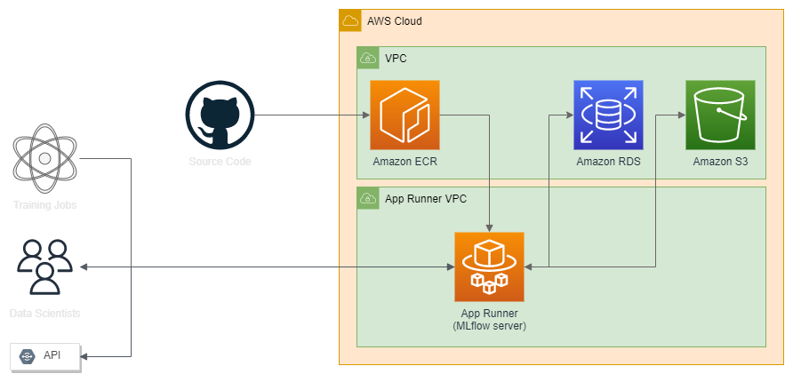
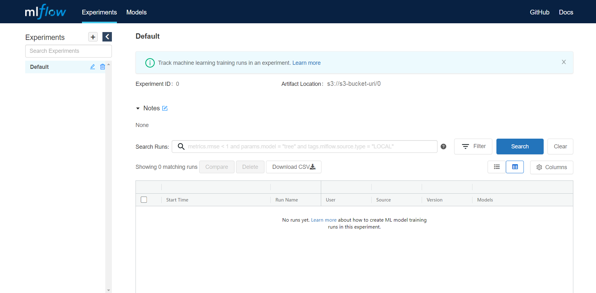

# [MLflow](https://www.mlflow.org/) with basic auth

![](https://img.shields.io/badge/MLflow-0077B5?style=for-the-badge&logo=data:image/svg+xml;base64,PHN2ZyB3aWR0aD0iMjQiIGhlaWdodD0iMjUiIHZpZXdCb3g9IjAgMCAyNCAyNSIgZmlsbD0ibm9uZSIgeG1sbnM9Imh0dHA6Ly93d3cudzMub3JnLzIwMDAvc3ZnIj4KPHBhdGggZD0iTTE4Ljk1MDkgMi4xNzYzNEMxNC4wNjM1IC0xLjI0MzQ1IDcuNDA5MjYgLTAuNTcxMDUxIDMuMzA0ODUgMy43NTczNUMtMC43OTk1NTYgOC4wODU3NiAtMS4xMTc3NiAxNC43NjYzIDIuNTU2NjcgMTkuNDY1Mkw2LjIyNTI0IDE2Ljc3MjRDNC40MDQyMyAxNC41MTM0IDQuMDM0MzcgMTEuNDEyNCA1LjI3Mjk4IDguNzg4NDNDNi41MTE1OSA2LjE2NDQ4IDkuMTQwOCA0LjQ3OTE0IDEyLjA0MjIgNC40NDkyOUwxMS45NTU0IDcuMzE1ODFMMTguOTUwOSAyLjE3NjM0WiIgZmlsbD0iIzQzQzlFRCIvPgo8cGF0aCBkPSJNMjEuNjYzOSA0Ljg1MTc2QzIxLjU0MjMgNC42ODM4MiAyMS40MTQ5IDQuNTE4NzggMjEuMjg0NiA0LjM1OTUzTDE3Ljc1MjEgNi45NjU0NkMxOS43NDYzIDkuMTcyMzIgMjAuMjYzNyAxMi4zNDI0IDE5LjA3NDYgMTUuMDY4OEMxNy44ODU2IDE3Ljc5NTIgMTUuMjEwNCAxOS41NzI4IDEyLjIzNjIgMTkuNjEyOUwxMi4zMjMxIDE2Ljc0OTNMNS4yNDk0NSAyMS45NjExQzEwLjA5NzEgMjUuMjI1NSAxNi41ODk2IDI0LjUzMzcgMjAuNjQwNiAyMC4zMjEzQzI0LjY5MTcgMTYuMTA4OSAyNS4xMjk1IDkuNTk0MzcgMjEuNjc4NCA0Ljg3NzgyTDIxLjY2MzkgNC44NTE3NloiIGZpbGw9IiMwMTk0RTIiLz4KPC9zdmc+Cg==&logoColor=white)


A dockerized MLflow Tracking Server with basic auth (username and password).

You will have three options to deploy the server: [AWS](#aws), [Heroku](#heroku), and [local](#local).

We provide a [Terraform](https://www.terraform.io/) stack that can be easily used to deploy the MLflow Tracking Server.

> **NOTE**: This project is not intended to be used for production deployments. It is intended to be used for testing and development.

## Environment Variables

The environment variables below are required to deploy this project.

| Variable | Description | Default |
| - | - | - |
| PORT | Port for the MLflow server | `80` |
| MLFLOW_ARTIFACT_URI | S3 Bucket URI for MLflow's artifact store | `"./mlruns"`
| MLFLOW_BACKEND_URI | [SQLAlchemy database uri](https://docs.sqlalchemy.org/en/latest/core/engines.html#database-urls) (if provided, the other variables `MLFLOW_DB_*` are ignored) | |
| DATABASE_URL | [SQLAlchemy database uri](https://docs.sqlalchemy.org/en/latest/core/engines.html#database-urls), it's used by Heroku deployment. Basically, we will move it to `MLFLOW_BACKEND_URI`. | |
| MLFLOW_DB_DIALECT | Database dialect (e.g. postgresql, mysql+pymysql, sqlite) | `"postgresql"` |
| MLFLOW_DB_USERNAME | Backend store username | `"mlflow"` |
| MLFLOW_DB_PASSWORD | Backend store password | `"mlflow"` |
| MLFLOW_DB_HOST | Backend store host | |
| MLFLOW_DB_PORT | Backend store port | `3306` |
| MLFLOW_DB_DATABASE | Backend store database | `"mlflow"` |
| MLFLOW_TRACKING_USERNAME | Username for MLflow UI and API | `"mlflow"` |
| MLFLOW_TRACKING_PASSWORD | Password for MLflow UI and API | `"mlflow"` |

## Deploying MLflow Tracking Server

### AWS



<details><summary>Amazon ECR</summary>
<p>

[Amazon Elastic Container Registry (ECR)](https://aws.amazon.com/ecr/) is a fully managed container registry that makes it easy to store, manage, share, and deploy your container images and artifacts anywhere.

</p>
</details>

<details><summary>App Runner</summary>
<p>

[AWS App Runner](https://aws.amazon.com/apprunner/) is a fully managed service that makes it easy for developers to quickly deploy containerized web applications and APIs, at scale and with no prior infrastructure experience required. Start with your source code or a container image.

</p>
</details>

<details><summary>Amazon S3</summary>
<p>

[Amazon Simple Storage Service (Amazon S3)](https://aws.amazon.com/s3/) is an object storage service that offers industry-leading scalability, data availability, security, and performance.

</p>
</details>

<details><summary>Amazon Aurora Serverless</summary>
<p>

[Amazon Aurora Serverless](https://aws.amazon.com/rds/aurora/serverless/) is an on-demand, auto-scaling configuration for Amazon Aurora. It automatically starts up, shuts down, and scales capacity up or down based on your application's needs. You can run your database on AWS without managing database capacity.

</p>
</details>

#### Prerequisites

- [AWS Account](https://console.aws.amazon.com/console/)
- [AWS CLI](https://aws.amazon.com/cli/)
- [Terraform CLI](https://www.terraform.io/downloads.html)

To deploy MLflow, you'll need to:

1. [Create an AWS account](https://aws.amazon.com/free/) if you don't already have one.

2. Configure AWS CLI to use your AWS account.

3. Clone this repository.

```bash
git clone https://github.com/DougTrajano/mlflow-server.git
```

4. Open `mlflow-server/terraform` folder.

```bash
cd mlflow-server/terraform
```

5. Run the following command to create all the required resources:

```bash
terraform init
terraform apply -var mlflow_username="YOUR-USERNAME" -var mlflow_password="YOUR-PASSWORD"
```

Multiple usernames and passwords can also be specified in a comma-delimited string:

```bash
terraform apply -var mlflow_username="USERNAME1,USERNAME2,USERNAME3" -var mlflow_password="PASSWORD1,PASSWORD2,PASSWORD3"
```

See a full list of variables that can be used in [terraform/variables.tf](terraform/variables.tf).

6. Type "yes" when prompted to continue.

```log
Plan: 21 to add, 0 to change, 0 to destroy.

Changes to Outputs:
  + artifact_bucket_id = (known after apply)
  + mlflow_password    = (sensitive value)
  + mlflow_username    = "doug"
  + service_url        = (known after apply)
  + status             = (known after apply)

Do you want to perform these actions?
  Terraform will perform the actions described above.
  Only 'yes' will be accepted to approve.

  Enter a value: yes
```

This will create the following resources:

- An [S3 bucket](https://aws.amazon.com/s3/) is used to store MLflow artifacts.
- An [IAM role and [policy](https://aws.amazon.com/iam/) that allows MLflow to access the S3 bucket.
- An [Aurora RDS Serverless](https://aws.amazon.com/rds/aurora/serverless/) database (PostgreSQL) is used to store MLflow data.
- An [App Runner](https://aws.amazon.com/apprunner/) that will run the MLflow Tracking Server.
- (Optional) A set of network resources such as [VPC](https://aws.amazon.com/vpc/), [Subnet](https://aws.amazon.com/ec2/subnets/), and [Security group](https://aws.amazon.com/ec2/security-groups/).

### Heroku

#### Prerequisites

- [Heroku Account](https://dashboard.heroku.com/)
- [AWS Account](https://console.aws.amazon.com/console/)
  - The [Heroku](#heroku) deployment will use an Amazon S3 bucket for storing the MLflow tracking data.
- [AWS CLI](https://aws.amazon.com/cli/)
- [Terraform CLI](https://www.terraform.io/downloads.html)

1. [Create an AWS account](https://aws.amazon.com/free/) if you don't already have one.

2. Configure AWS CLI to use your AWS account.

3. Clone this repository.

```bash
git clone https://github.com/DougTrajano/mlflow-server.git
```

4. Open `mlflow-server/terraform` folder.

```bash
cd mlflow-server/terraform
```

5. Run the following command to create only the S3 bucket

```bash
terraform init
terraform apply -var environment="heroku" -target="module.s3"
```

6. Type "yes" when prompted to continue.

```log
Plan: 5 to add, 0 to change, 0 to destroy.

Changes to Outputs:
  + artifact_bucket_id = (known after apply)

Do you want to perform these actions?
  Terraform will perform the actions described above.
  Only 'yes' will be accepted to approve.

  Enter a value: yes
```

2. Create an IAM Policy for the S3 bucket as follows:

<details><summary>IAM Policy example</summary>
<p>

```json
{
    "Version": "2012-10-17",
    "Statement": [
        {
            "Effect": "Allow",
            "Action": [
              "s3:ListBucket"
            ],
            "Resource": "arn:aws:s3:::mlflow-heroku-20220723133820303500000001"
          },
        {
            "Effect": "Allow",
            "Action": [
                "s3:*",
                "s3-object-lambda:*"
            ],
            "Resource": "arn:aws:s3:::mlflow-heroku-20220723133820303500000001/*"
        }
    ]
}
```

</p>
</details>

3. Create an IAM User and attach the IAM Policy previously created.

> Take note of the IAM User access key and secret key, you'll need them in the step 5.

4. Click on the "Deploy to Heroku" button below.

[](https://heroku.com/deploy?template=https://github.com/DougTrajano/mlflow-server/tree/main)

5. Follow the instructions on the new page to create an MLflow Tracking Server.

### Local

#### Prerequisites

- [Docker](https://www.docker.com/) and [Docker Compose](https://docs.docker.com/compose/install/).

1. Clone this repository.

```bash
git clone https://github.com/DougTrajano/mlflow-server.git
```

2. Open the `mlflow-server` folder.

```bash
cd mlflow-server
```

3. Run the following command to create all the required resources:

```bash
docker-compose up -d --build
```

## Using your deployed MLflow

The link that you will use to access the MLflow Tracking Server will depend on the deployment method you choose.

- For [AWS](#aws), the link will be something like `https://XXXXXXXXX.aws-region.awsapprunner.com/`.
  - You can find it in the [AWS App Runner console](https://us-east-1.console.aws.amazon.com/apprunner/home).
- For [Heroku](#heroku), the link will be something like `https://XXXXXXXXX.herokuapp.com/`.
  - You can find it in the [Heroku dashboard](https://dashboard.heroku.com/apps/).
- For [Local](#local), the link will be something like `http://localhost:80/`.



Also, you can track your experiments using MLflow API.

```python
import os
import mlflow

os.environ["MLFLOW_TRACKING_URI"] = "<<YOUR-MLFLOW-TRACKING-URI>>"
os.environ["MLFLOW_EXPERIMENT_NAME"] = "<<YOUR-EXPERIMENT-NAME>>"
os.environ["MLFLOW_TRACKING_USERNAME"] = "<<YOUR-MLFLOW-USERNAME>>"
os.environ["MLFLOW_TRACKING_PASSWORD"] = "<<YOUR-MLFLOW-PASSWORD>>"

# AWS AK/SK are required to upload artifacts to S3 Bucket
os.environ["AWS_ACCESS_KEY_ID"] = "<<AWS-ACCESS-KEY-ID>>"
os.environ["AWS_SECRET_ACCESS_KEY"] = "<<AWS-SECRET-ACCESS-KEY>>"

SEED = 1993

mlflow.start_run()
mlflow.log_param("seed", SEED)
mlflow.end_run()
```

## References

- [Managing your machine learning lifecycle with MLflow and Amazon SageMaker | AWS Machine Learning Blog](https://aws.amazon.com/pt/blogs/machine-learning/managing-your-machine-learning-lifecycle-with-mlflow-and-amazon-sagemaker/)
- [Introducing AWS App Runner](https://aws.amazon.com/pt/blogs/containers/introducing-aws-app-runner/)
- [MLflow Documentation](https://www.mlflow.org/docs/latest/index.html) (current version: 1.27.0)
- [soundsensing/mlflow-easyauth: Deploy MLflow with HTTP basic authentication using Docker](https://github.com/soundsensing/mlflow-easyauth)
